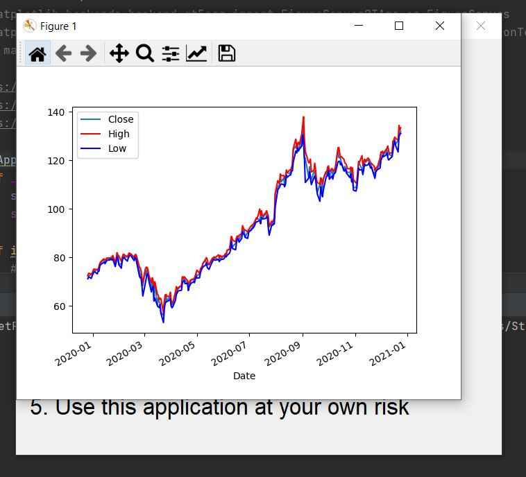
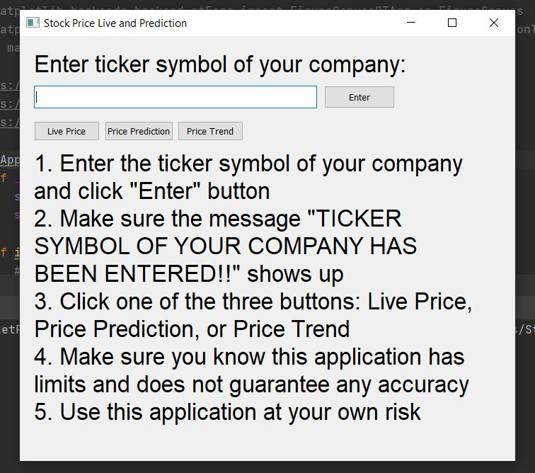
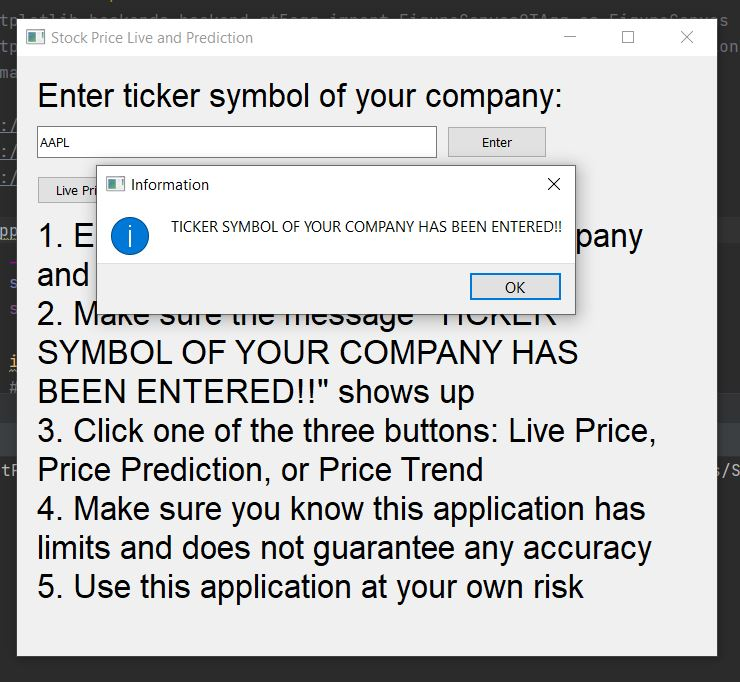
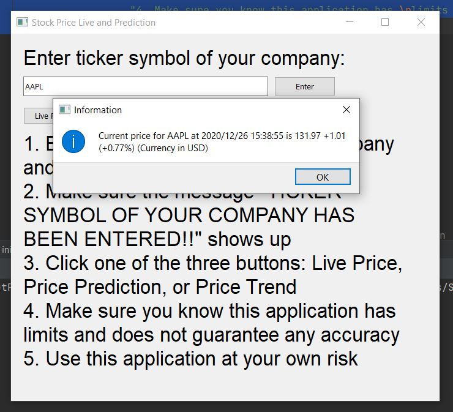

# StockMarketPrice

StockMarketPrice is a stock price information application. 

## Description

This application helps you view the current live stock price, 1-year stock price trend, and stock price estimation of a company of your interest. It is simple and easy to use and most importantly, free of charge.

Here are some screenshots of application usage:

## Usage

1. Download two python files: main.py and stockPrice.py
2. Put these two files inside the same folder
3. On your favorite IDE, run main.py
4. Read the instruction before you use it.

Here is the instruction:

1. Enter the ticker symbol of your company and click "Enter" button
2. Make sure the message "TICKER SYMBOL OF YOUR COMPANY HAS BEEN ENTERED!!" shows up
3. Click one of the three buttons: Live Price, Price Prediction, or Price Trend
4. Make sure you know this application has limits and does not guarantee any accuracy
5. Use this application at your own risk

## Future Improvements
1. Improve price prediction algorithm (Currently using polynomial regression despite the fact that machine learning is required)
2. Figure out a way to distribute this application so that those who do not have a python IDE can also use it.

# ***ENJOY!***
:chart_with_upwards_trend: :chart_with_downwards_trend:
